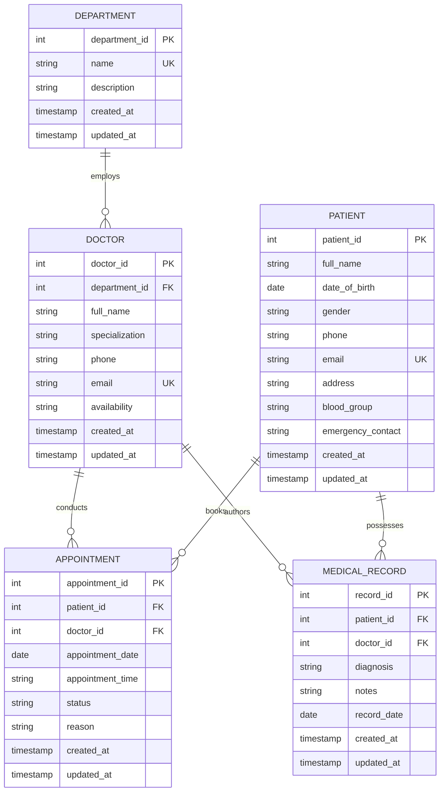

# Entity-Relationship (ER) Diagram
## Hospital / Patient Management System (HMS)

### 1. Visual Entity-Relationship Diagram (Mermaid Format)

---

### 2. Relationship Cardinality & Constraints

1. **DEPARTMENT to DOCTOR (1 to Many):**
   - One Department can have zero, one, or many Doctors.
   - Each Doctor is assigned to exactly one Department (`department_id` Foreign Key).

2. **DOCTOR to APPOINTMENT (1 to Many):**
   - One Doctor can conduct many Appointments across dates and time slots.
   - Each Appointment is assigned to exactly one Doctor (`doctor_id` Foreign Key).
   - Constraint: A Doctor cannot have duplicate Appointments at the same `(appointment_date, appointment_time)`.

3. **PATIENT to APPOINTMENT (1 to Many):**
   - One Patient can schedule multiple Appointments over time.
   - Each Appointment belongs to exactly one Patient (`patient_id` Foreign Key).

4. **DOCTOR to MEDICAL_RECORD (1 to Many):**
   - One Doctor can author multiple clinical Medical Records.
   - Each Medical Record references the attending Doctor (`doctor_id` Foreign Key).

5. **PATIENT to MEDICAL_RECORD (1 to Many):**
   - One Patient has an accumulated history of multiple Medical Records.
   - Each Medical Record references exactly one Patient (`patient_id` Foreign Key).

---

### 3. Model Alignment Guarantee
This diagram precisely mirrors:
- Django models in `backend/apps/hospital/models.py`
- Room entities in `app/src/main/java/com/example/data/local/entities/`
- PostgreSQL DDL schema in `docs/database.md`
